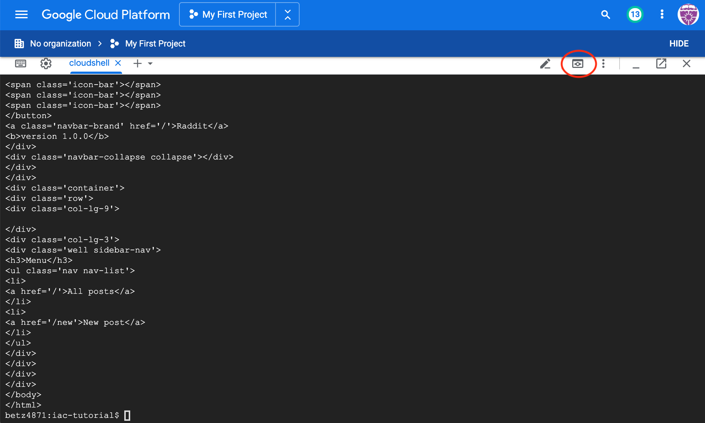
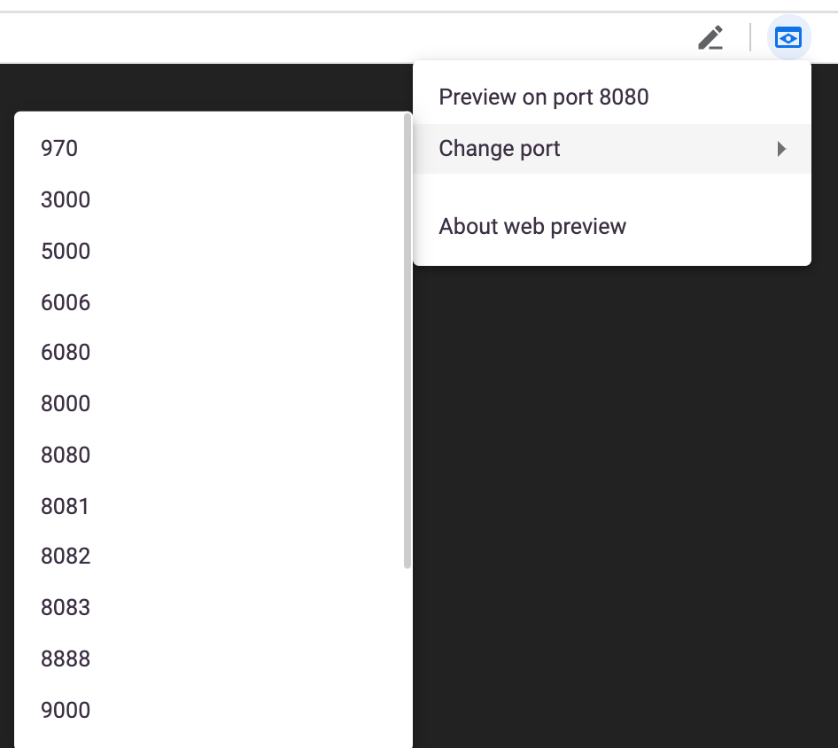

## Docker

In this lab, we will talk about managing containers for the first time in this tutorial. Particularly, we will talk about [Docker](https://www.docker.com/what-docker) which is the most widely used platform for running containers.

## Intro

Remember when we talked about packer, we mentioned a few words about `Immutable Infrastructure` model? The idea was to package all application dependencies and application itself inside a machine image, so that we don't have to configure the system after start. Containers implement the same model, but they do it in a more efficient way.

Containers allow you to create self-contained isolated environments for running your applications.

They have some significant advantages over VMs in terms of implementing Immutable Infrastructure model:

* `Containers are much faster to start than VMs.` Container starts in seconds, while a VM takes minutes. It's important when you're doing an update/rollback or scaling your service.
* `Containers enable better utilization of compute resources.` Very often computer resources of a VM running an application are underutilized. Launching multiple instances of the same application on one VM has a lot of difficulties: different application versions may need different versions of dependent libraries, init scripts require special configuration. With containers, running multiple instances of the same application on the same machine is easy and doesn't require any system configuration.
* `Containers are more lightweight than VMs.` Container images are much smaller than machine images, because they don't need a full operating system in order to run. In fact, a container image can include just a single binary and take just a few MBs of your disk space. This means that we need less space for storing the images and the process of distributing images goes faster.

Let's try to implement `Immutable Infrastructure` model with Docker containers, while paying special attention to the `Dockerfile` part as a way to practice `Infrastructure as Code` approach.

## (FOR PERSONAL LAPTOPS AND WORKSTATIONS ONLY) Install Docker Engine

_Docker is already installed on Google Cloud Shell._

The [Docker Engine](https://docs.docker.com/engine/docker-overview/#docker-engine) is the daemon that gets installed on the system and allows you to manage containers with simple CLI.

[Install](https://www.docker.com/community-edition) free Community Edition of Docker Engine on your system.

Verify that the version of Docker Engine is => 17.09.0:

```bash
$ docker -v
```

## Create Dockerfile

You describe a container image that you want to create in a special file called **Dockerfile**.

Dockerfile contains `instructions` on how the image should be built. Here are some of the most common instructions that you can meet in a Dockerfile:

* `FROM` is used to specify a `base image` for this build. It's similar to the builder configuration which we defined in a Packer template, but in this case instead of describing characteristics of a VM, we simply specify a name of a container image used for build. This should be the first instruction in the Dockerfile.
* `ADD` and `COPY` are used to copy a file/directory to the container. See the [difference](https://stackoverflow.com/questions/24958140/what-is-the-difference-between-the-copy-and-add-commands-in-a-dockerfile) between the two.
* `RUN` is used to run a command inside the image. Mostly used for installing packages.
* `ENV` sets an environment variable available within the container.
* `WORKDIR` changes the working directory of the container to a specified path. It basically works like a `cd` command on Linux.
* `CMD` sets a default command, which will be executed when a container starts. This should be a command to start your application.

Let's use these instructions to create a Docker container image for our raddit application.

Create a folder called `docker` inside your `iac-tutorial` repo. Inside of that new directory, create a text file called `Dockerfile` with the following content:

```
# Use base image with Ruby installed
FROM ruby:2.3

# install required system packages
RUN apt-get update -qq && \
    apt-get install -y build-essential

# create application directory and install dependencies
ENV APP_HOME /app
RUN mkdir $APP_HOME
WORKDIR $APP_HOME
COPY raddit-app/Gemfile* $APP_HOME/
RUN bundle install

# Copy the application code to the container
ADD raddit-app/ $APP_HOME
# Run "puma" command on container's start
CMD ["puma"]
```

This Dockerfile repeats the steps that we did multiple times by now to configure a running environment for our application and run it.

We first choose an image that already contains Ruby of required version:
```
# Use base image with Ruby installed
FROM ruby:2.3
```

The base image is downloaded from Docker official registry (storage of images) called [Docker Hub](https://hub.docker.com/).

We then install required system packages and application dependencies:

```
# install required system packages
RUN apt-get update -qq && \
    apt-get install -y build-essential

# create application home directory and install dependencies
ENV APP_HOME /app
RUN mkdir $APP_HOME
WORKDIR $APP_HOME
COPY raddit-app/Gemfile* $APP_HOME/
RUN bundle install
```

Then we copy the directory with application code and specify a default command that should be run when a container from this image starts:

```
# Copy the application code to the container
ADD raddit-app/ $APP_HOME
# Run "puma" command on container's start
CMD ["puma"]
```

## Build Container Image

Once you defined how your image should be built, run the following command inside `iac-tutorial` directory to create a container image for raddit application:

```bash
$ docker build --tag raddit .
```

The resulting image will be named `raddit`. Find it in the list of your local images:

```bash
$ docker images | grep raddit
```

## Bridge Network

We are going to run multiple containers in this setup. To allow containers communicate with each other by container names, we'll create a [user-defined bridge network](https://docs.docker.com/engine/userguide/networking/#user-defined-networks):

```bash
$ docker network create raddit-network
```

Verify that the network was created:

```bash
$ docker network ls
```

## MongoDB Container

We shouldn't forget that we also need a MongoDB for our application to work.

The philosophy behind containers is that we create one container per process. So we'll run MongoDB in another container.

We will use a public image from Docker Hub to run a MongoDB container alongside raddit application container. However, I recommend you for the sake of practice write a Dockerfile for MongoDB and create your own image.

Because MongoDB is a stateful service, we'll first create a named volume for it to persist the data beyond the container removal.

```bash
$ docker volume create mongo-data
```

Check that volume was created:

```bash
$ docker volume ls | grep mongo-data
```

Now run the following command to download a MongodDB image and start a container from it:

```bash
$ docker run --name mongo-database \
    --volume mongo-data:/data/db \
    --network raddit-network \
    --detach mongo:3.2
```

Verify that the container is running:

```bash
$ docker container ls
```

## Start Application Container

Start the application container from the image you've built:

```bash
$ docker run --name raddit-app \
    --env DATABASE_HOST=mongo-database \
    --network raddit-network \
    --publish 9292:9292 \
    --detach raddit
```

Note, how we also passed an environment variable with the command to the application container. Since MongoDB is not reachable at `localhost` as it was in the previous labs, [we need to pass the environment variable with MongoDB address](https://github.com/Artemmkin/iac-tutorial/blob/master/raddit-app/app.rb#L11) to tell our application where to connect. Automatic DNS resolution of container names within a user-defined network makes it possible to simply pass the name of a MongoDB container instead of an IP address.

Port mapping option (`--publish`) that we passed to the command is used to make the container reachable to the outsite world.

## Access Application

To access via the Google Cloud Shell, use the Web Preview: 



AT THIS WRITING, you cannot select port 9292. Select any offered port: 



You will receive an error. Notice your URL which should look something like this: 

`https://8080-dot-8658285-dot-devshell.appspot.com/?authuser=0`

The first four digits after the `https://` represent the desired port. Change this to 9292, for example:

`https://9292-dot-8658285-dot-devshell.appspot.com/?authuser=0`

(Do not try to use that URL. Modify the one provided you.)

You should now be able to see the application. 

(If you are running this tutorial locally, the application should be accessible to your at http://localhost:9292)

## Save and commit the work

Save and commit the `Dockerfile` created in this lab into your `iac-tutorial` repo.

## Conclusion

In this lab, you adopted containers for running your application. This is a different type of technology from what we used to deal with in the previous labs. Nevertheless, we use Infrastructure as Code approach here, too.

We describe the configuration of our container image in a Dockerfile using Dockerfile's syntax. We then save that Dockefile in our application repository. This way we can build the application image consistently across any environments.

Destroy the current playground before moving on to the next lab.

```bash
$ docker rm -f mongo-database
$ docker rm -f raddit-app
$ docker volume rm mongo-data
$ docker network rm raddit-network
```

Next: [Docker Compose](09-docker-compose.md)
